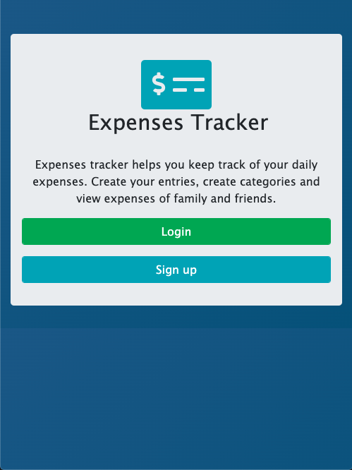
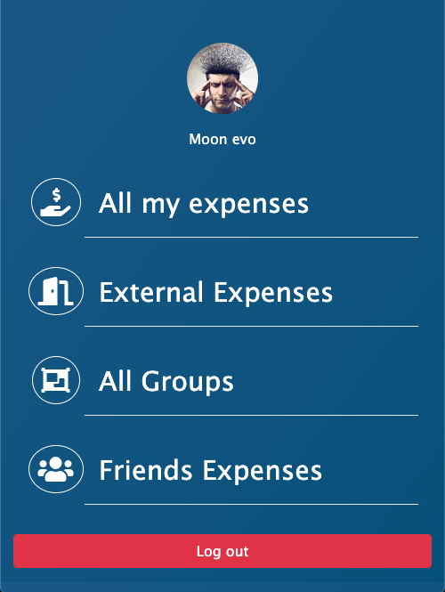
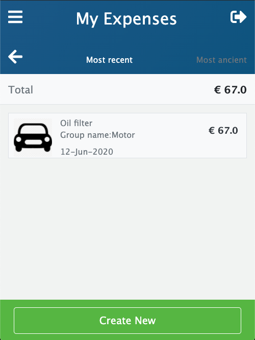

# Expenses Tracker application with Ruby on Rails

> A Ruby on Rails application based on grouping expenses by goal for you and family/friends.

# Screenshots!










## Built With

- Ruby v2.6.5
- Ruby on Rails v5.2.4
- VSCode
- Terminal
- Rubocop
- RSpec

## Live Demo

Visit live demo [here!]()

## App Features

As a guest user:

    You can create account/log in.

As an authenticated user:

    You log in to the app, only by typing an email and password.
    You are presented with a profile page that includes links to:
      - All your expenses
      - External expenses
      - All groups
      - Friends Expenses
    When you open "All my expenses" page:
      - Total amount is displayed at the top.
      - A list of all expenses you have created.
      - An action button that allow you to create a new expense.
    When you open "External Expenses" page:
      - A list of all expenses you created are shown, but not assigned to any group.
    When you open "All groups" page:
      - A list of all groups is displayed.
      - An action button "Create new" is displayed.
    When you open the "Group transactions" page:
      - A list of all transactions that belong to that group is displayed.
    When user opens "Create new group" or "Create new expense" page:
      - A form with all necessary fields is displayed to create entry

## Getting Started

- **Terminal(Mac & Linux) or Command Prompt(Windows)**: This is where you will run all commands.
- **Clone**: clone this repository to your local machine.
- **Ruby Enviroment**: if you do not have ruby installed visit this [link](https://www.ruby-lang.org/en/documentation/installation/) to install.
- **Rails**: install rails gem by running command *$ gem install rails* -v 5.2.4.
- **bundle**: run $ bundle install. This installs all gems declared in the Gemfile
- **Database Migration**: run *$ rails db:migrate* in console to run database migrations on your local machine

### Usage

Start server with:

```
    rails server
```

Open `http://localhost:3000/` in your browser.

### Run tests

```
    bundle exec rspec
```

## Authors 

👤 **Elbie Moonga**

- GitHub: [@Elbie-Em](https://github.com/Elbie-em)
- Twitter: [ElbieEm](https://twitter.com/ElbieEm)
- LinkedIn: [elbie-moonga](https://www.linkedin.com/in/elbiemoonga) 

---

## 🤝 Contributing

Contributions, issues and feature requests are welcome!

Feel free to check the [issues page](issues/).

## Show your support

Give me a ⭐️ if you like this project!

## Acknowledgments

- [Microverse](https://microverse.org)

- [Gregoire Vella on Behance](https://www.behance.net/gregoirevella)

---

## 📝 License

This project is [MIT](/LICENSE) licensed.

---
